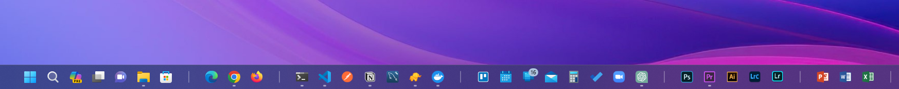

# Taskbar Divider
A creative way to keep your taskbar items organized!



I use this as a way for me to group apps that are most similar to each other. For example, I have a divider for all my web browsers, one for all my code related tasks, and one for all my content creation apps. This makes it easier for me to find the app I'm looking for, and it also makes my taskbar look much cleaner.

## How to use
> This should work on any version of Windows, but it's only been tested on Windows 10 & 11.

1. Download the contents by clicking the big green "Code" button and then "Download ZIP".

2. Extract the contents of the ZIP file to a folder of your choice.

3. Right click on the "divider.bat" file and click "Create shortcut". (If you're on Windows 11, you may need to click "Show more options")

4. Right click on the newly created shortcut and click "Properties".

5. Click on "Change Icon" and then "Browse".

6. Select the icon file (.ico) that was extracted from the ZIP file. And then make sure you click "Apply".

7. In the text field that says "Start in:", add the following *before* the text that is shown there

`explorer `

For example, if the text field says:

```
"C:\Users\YourName\Downloads\Taskbar-Divider"
```
you would change it to:
```
explorer "C:\Users\YourName\Downloads\Taskbar-Divider".
```

8. Click "Apply" again. And then click "OK".

9. Now you can pin this shortcut that you created to your taskbar! Either right click on it and click "Pin to taskbar", or drag it to your desired location on your taskbar.